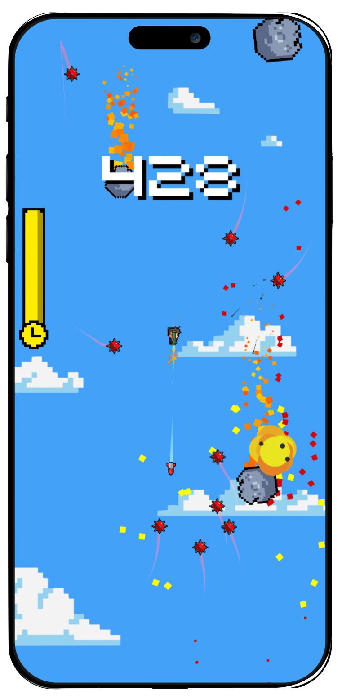

# RocketRob

## Summary
**RocketRob** is a Unity game that was released to the IOS App Store through Aphy Games. The game is a pixelated 2D platform-style game that depicts a character named Rob attempting to reach as high as possible in the sky! He is equipped with a rocket launcher that rapidly propels him away from the fired rocket, which is his main form of gaining height. He needs to dodge heat-seeking spike bombs and massive falling meteors and grab power-ups to help his mission. The inspiration for the game came from the classics Doodle Jump, Flappy Bird, and Jetpack Joyride.

<div style="text-align: center; gap: 20px;">
    
    
    
</div>

## Details

This project utilized Unity's 2D game design features to create the mobile game. All of the in-game assets, such as the character model, enemies, rockets, etc., were created by myself through pixel painting software or were modified from other sources. I utilized Unity's physics engine to handle the core interactions in the game. For instance, if there was a collision between the player and a meteor, a force vector would be applied in the opposite direction to the impact such that both objects would react realistically. Below is the example of how I measured the magnitude of the drag from the user to calculate the force and direction of where the player should move:

```bash
newCenter = cam.ScreenToWorldPoint(new Vector2(0, 0));

diffX = newCenter.x - center.x;
diffY = newCenter.y - center.y;

startPoint2 = new Vector2(startPoint.x + diffX, startPoint.y + diffY);

endPoint = cam.ScreenToWorldPoint(Input.mousePosition);
distance = Vector2.Distance(startPoint2, endPoint);
direction = (startPoint2 - endPoint).normalized;
PlayerAimWeapon.weaponAngle = Mathf.Atan2(direction.y, direction.x) * Mathf.Rad2Deg - 180;
```

## How to Play

### Running the Application
- Download the zip file for the project
- Open the project in Unity

### App Store
Currently, RocketRob is not listed on the App Store anymore. However, once I make changes to the Aphy Games website and my Apple Developer account, it will be back up!
